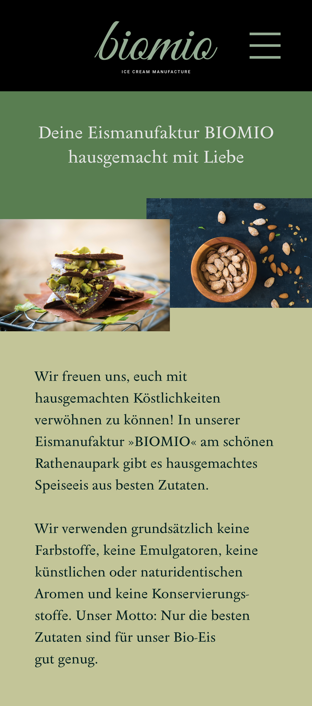
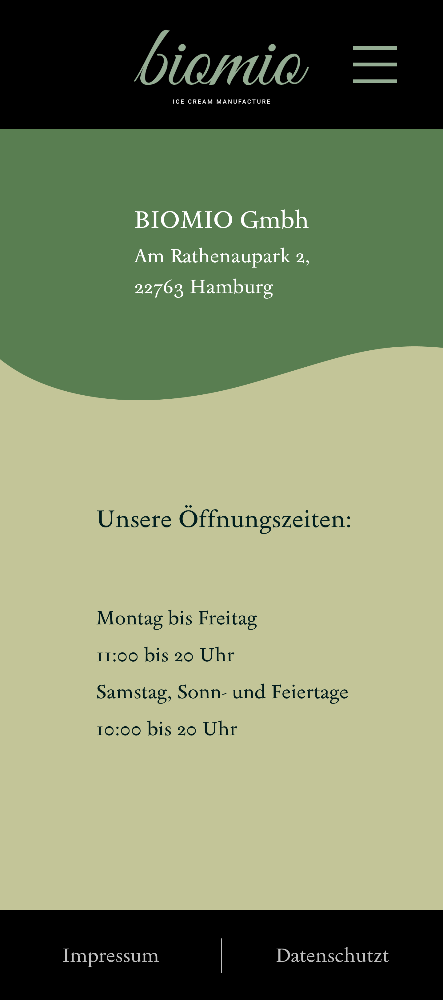

# Assessment-Test: BIOMIO Eismanufaktur (UI-Design)

Hallo! Dies ist ein UI-Design, das ich als Assessment-Test (Probeaufgabe) fuer die Firma wwwe.de waehrend meiner ITA-Ausbildung am BTI Neuss absolviert habe.

## Projekt-Kontext & Herausforderung

Die Aufgabe war ein zweitaegiges Assessment-Test unter strengen Pruefungsbedingungen.

**Zentrale Einschraenkung fuer beide Tage:** Es gab **keinen Internetzugang**. Alle Design-Entscheidungen (Tag 1) und aller Code (Tag 2) mussten offline und aus dem Gedaechtnis erstellt werden.

* **Tag 1 (Design):** Erstellung eines UI-Designs fuer die "BIOMIO" Eismanufaktur in Figma.
    * **Zeitlimit:** ca. 3 Schulstunden (3 x 45 Min.).
    * **Ressourcen:** Ein Informationstext ueber die Firma, eine Word-Datei mit Texten (fuer Copy-Paste) und ca. 20 Fotos.

* **Tag 2 (Umsetzung):** Technische Implementierung des Designs von Tag 1 in HTML/CSS.
    * **Zeitlimit:** 3 Stunden.

## Ergebnis & Beruflicher Werdegang

Aufgrund der Gesamtleistung in diesem Assessment-Test (besonders des Designs von Tag 1) wurde mir ein Ausbildungsplatz als Mediengestalter angeboten.

Ich habe mich stattdessen fuer ein Informatik-Studium entschieden, um meine technischen Faehigkeiten im Software Engineering zu vertiefen. (Kurz darauf wurde mir auch eine Stelle als UX/UI Designer bei CGI angeboten, die ich aus demselben Grund ebenfalls nicht annahm).

## Das Figma-Design (Tag 1)

*(Der Code von Tag 2 ist nicht mehr vorhanden. Dieses Repository zeigt die Figma-Designs von Tag 1, die als Vorlage fuer die Implementierung dienen sollten.)*

---

**Ansicht 1: Hero & Intro**

---

**Ansicht 2: Produkt-Praesentation**

---

**Ansicht 3: Ueber Uns & Zutaten**

---

**Ansicht 4: Kontakt & Oeffnungszeiten**

